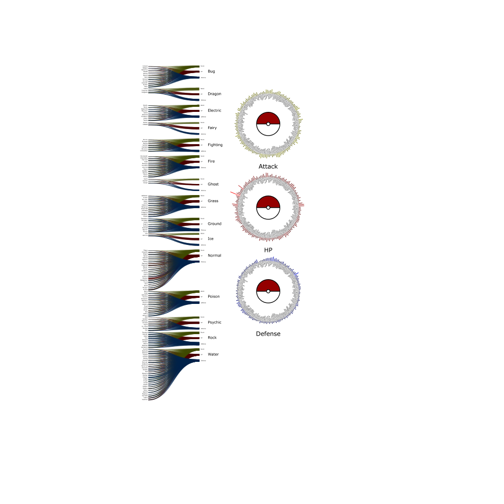

# Pokémon visualization using R ,ggplot2, and NodeBox.

In this document we can see a brief visual exploratory of the pokémon
data set provided by kaggle: <https://www.kaggle.com/alopez247/pokemon>.
My first videogame was the blue edition of pokémon, so i decided to do
this analisys only with the first generation data.

## R visualization.
I recomend the .md documents to read, inside you will find the R code.
## NodeBox visualization.
We can see the result of the work in pok.pdf. 

