In this document we can see a brief visual exploratory of the pokémon
data set provided by kaggle: <https://www.kaggle.com/alopez247/pokemon>.
My first videogame was the blue edition of pokémon, so i decided to do
this analisys only with the first generation data.

We will work with nine features: Name (Bulbasaur, Charmander...),Type of
pokemon (fire, water...), Total (the sum of the numeric features), HP ,
Attack, Defense, Special Attack, Special Defense, and Speed. Lets start
seeing how are distributed those features.

### Histogram of each variable.

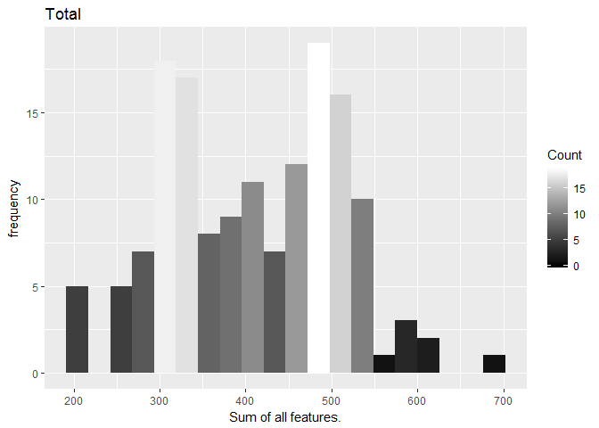

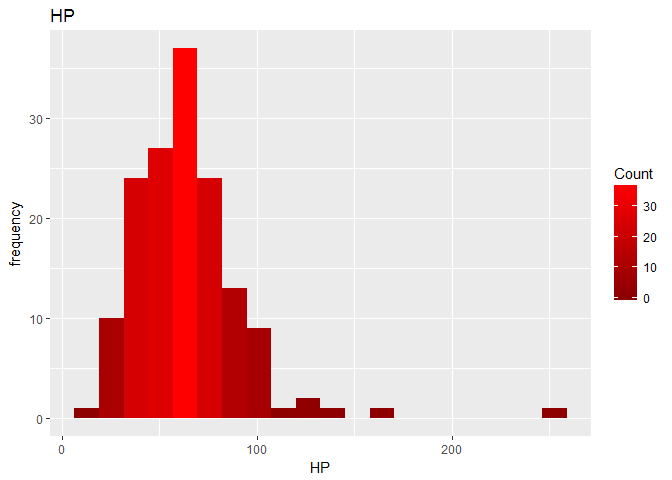

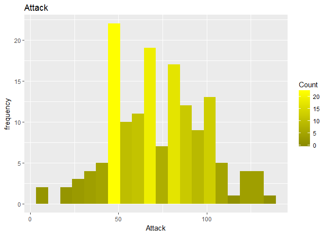

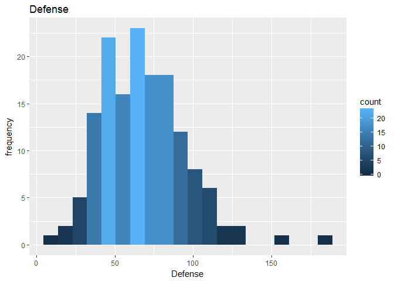

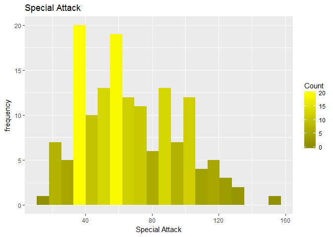

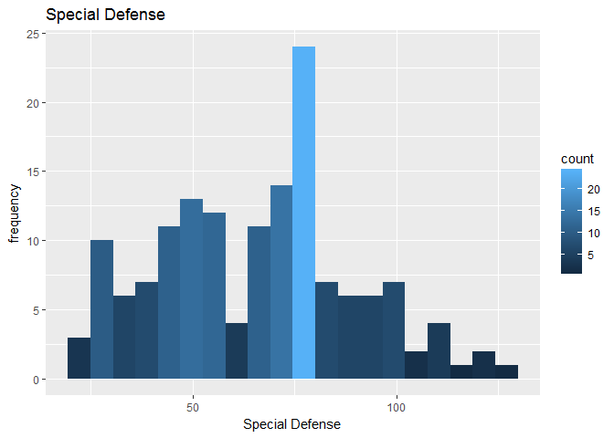

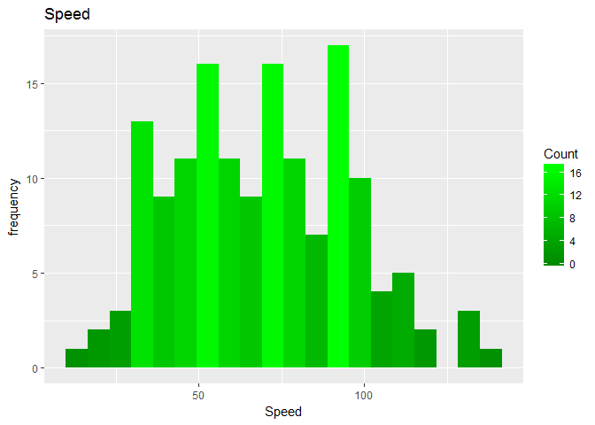

### Boxplots depending on type.

Now, lets compare the previuos features depending on the type of
pokémon.

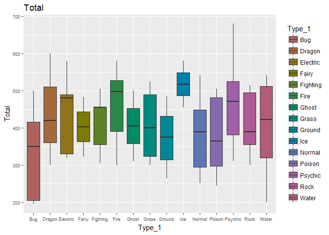

In general, we can think that ice pokémon are better, but also we can
see some Psychic pokémon with high numbers.

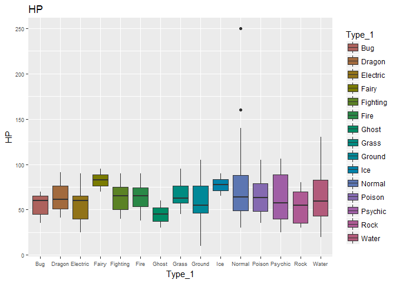

Here the ghosts are the worsts, and the normal and fairy seems the best
(we can see two atipical values). Although that, the results are
similar.

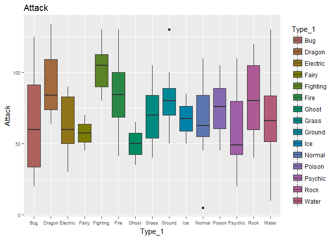

We can see that fighting pokemon have the best attack, while faiy and
ghost seems the worsts. But we have a high variances in some groups, so
it's dificult to take conclussions.

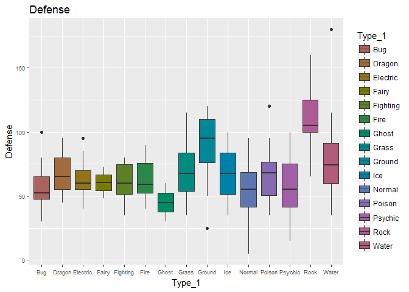

Rock pokemón seems to have the best defense, and ghosts the worst. In
the rest of groups the results are similar, although whe have some
atipical values.

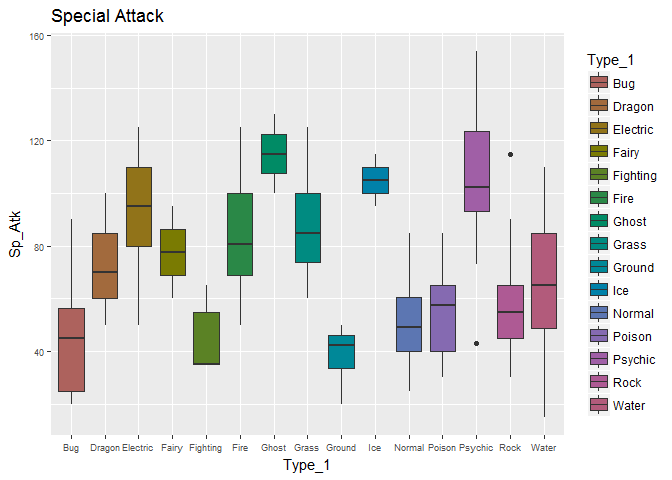

We can see that psychics and ghosts have the bests numbers in special
attack, as we expected. We can see that here the variances are quite
low, and the special attack depend on the group.

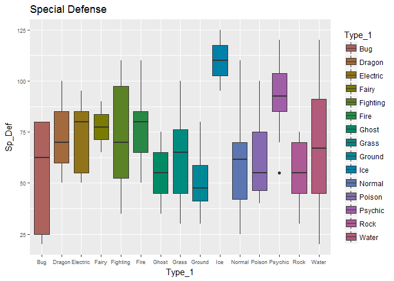

Most of the groups have similar values in special defense, but ice and
psychic (both of them have the bests results). Bug have a really high
variance with a low special defense for some pokémon.

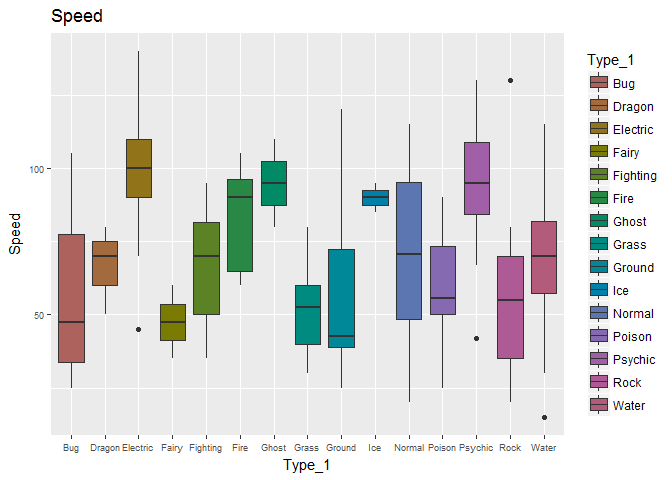

Electric and psychic have the highest values in speed (others group have
similar ones), while fairy and ground seems to have the worsts.

### Looking for correlated variables.

We cold try to look for dependencies betwen some variables, lets look
the correlations to see wich variables should we compare.

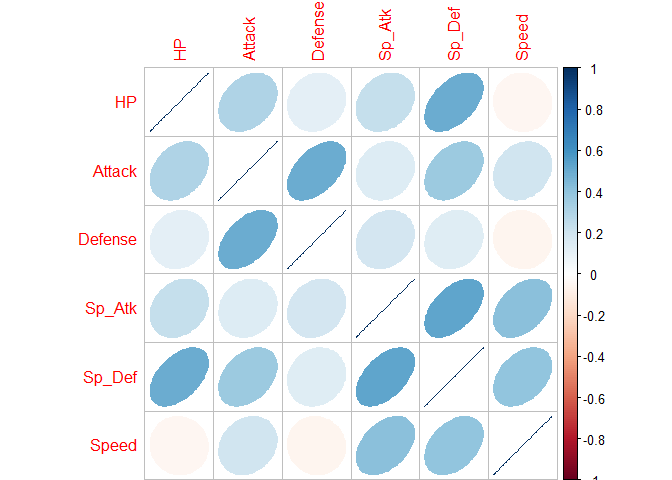

The highes variables are produced by attack with defense, HP with
special defense, and special attack with special defense.

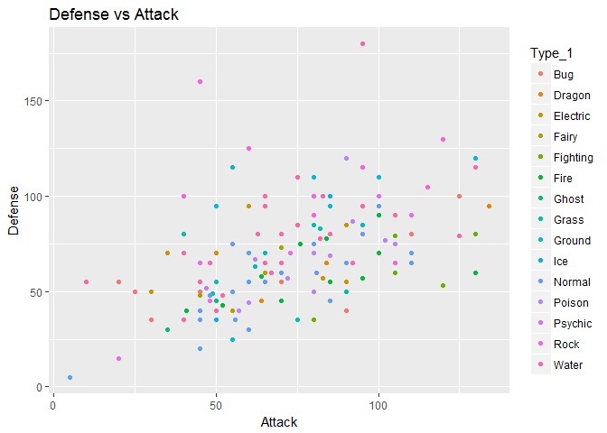

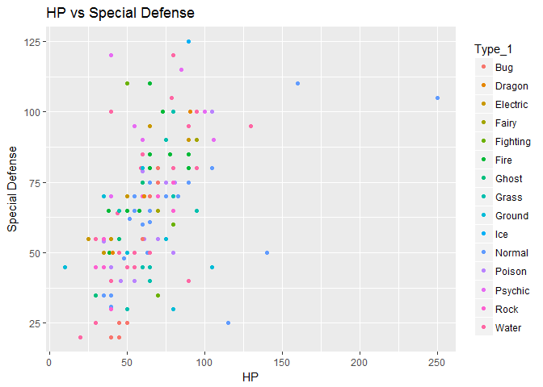

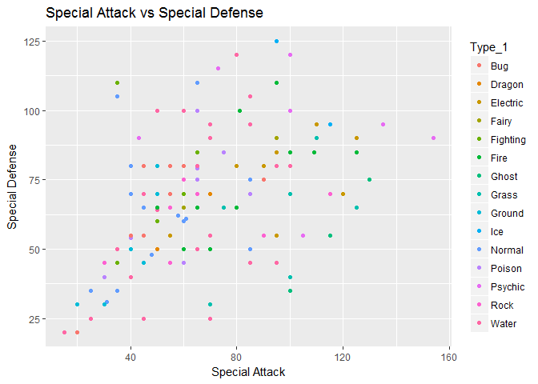

We can see just a little dependencie between the variables, maybe due to
the level of the pokémons. When the pokémons evolve, they increase their
numbers.
